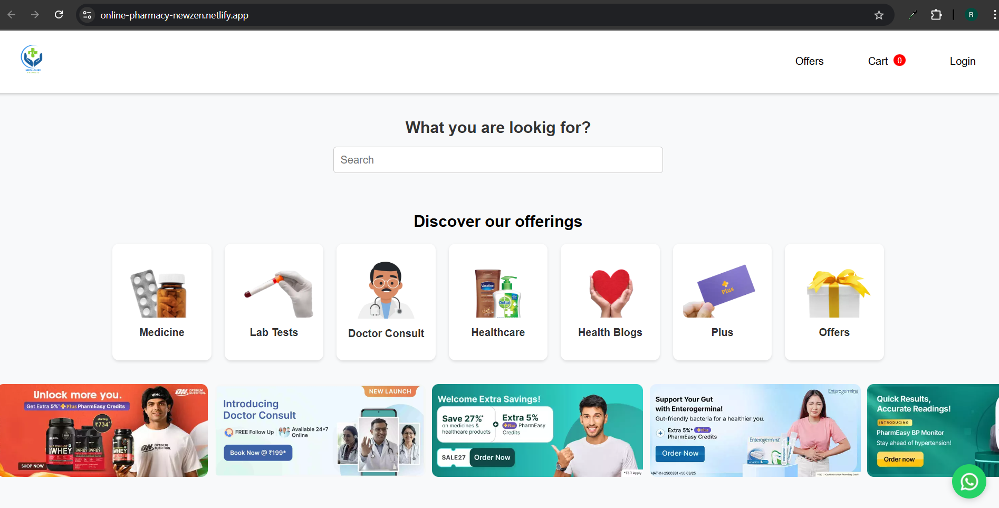
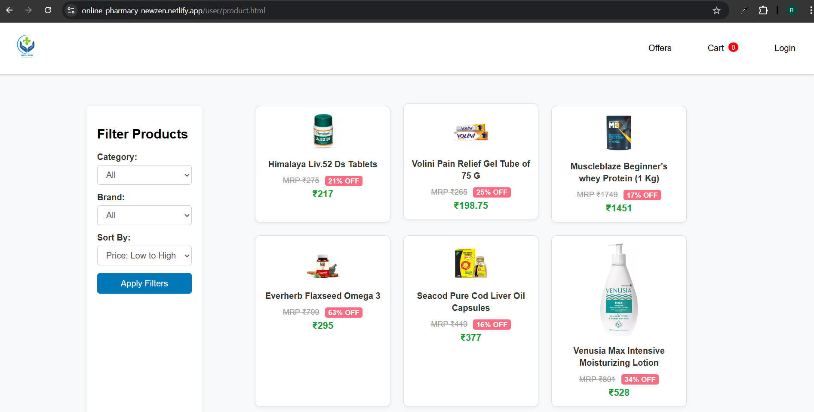
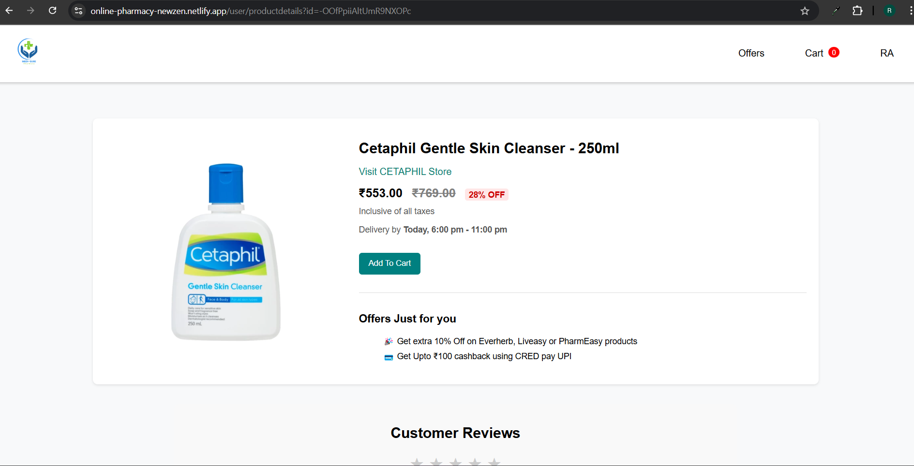
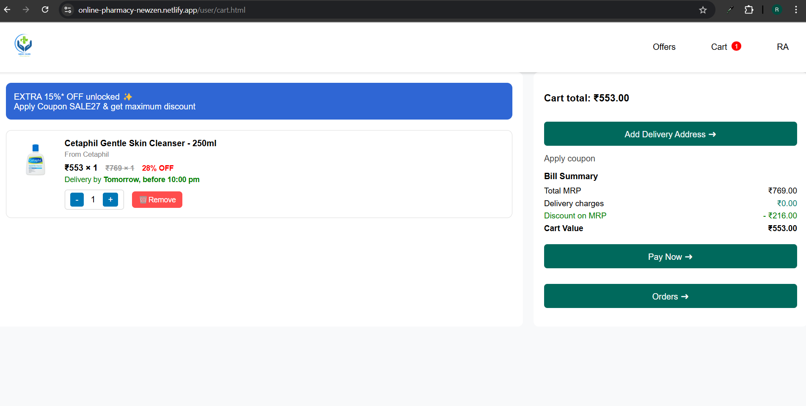
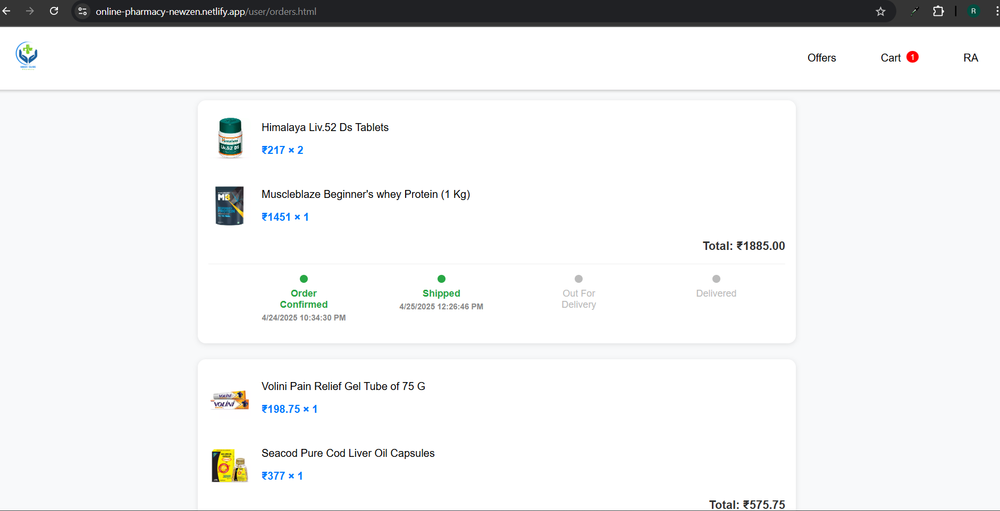
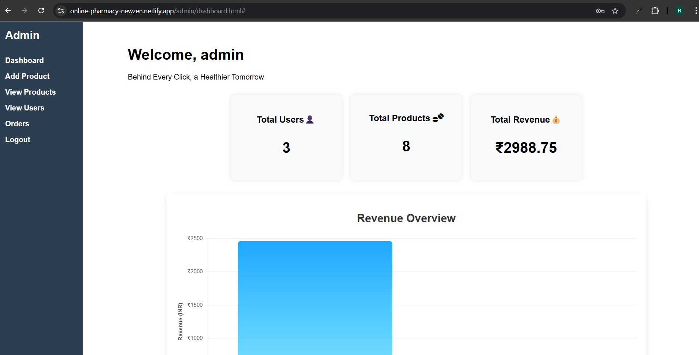
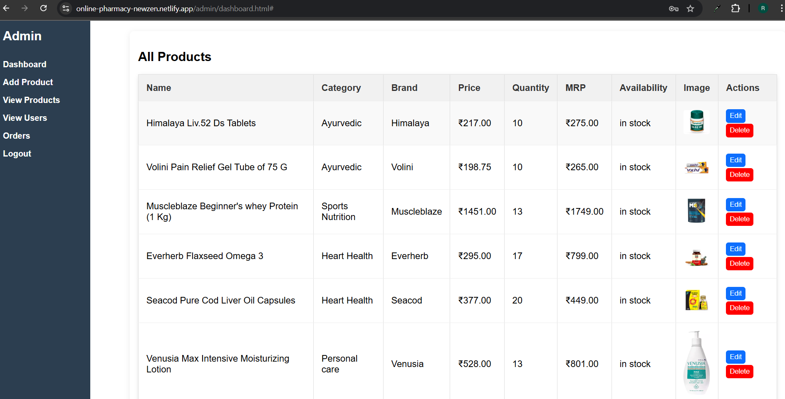
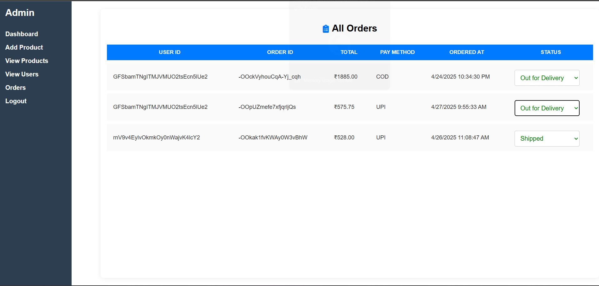
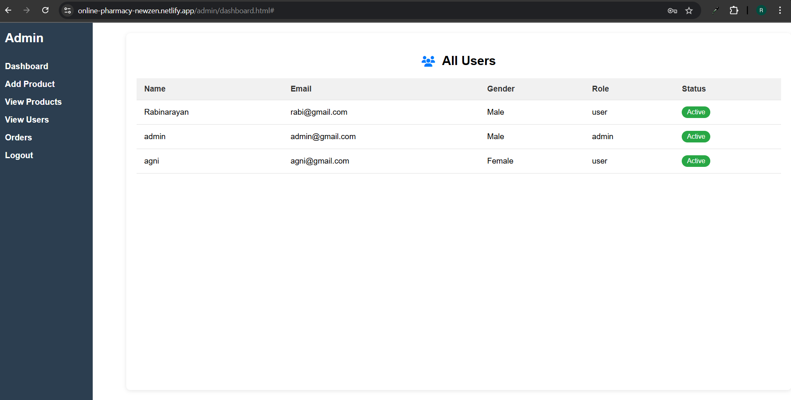

# Online Pharmacy

## Introduction

This is an Online Pharmacy web application built to allow users to easily browse, search, and purchase medicines online from the comfort of their homes.  
It simplifies the traditional pharmacy experience by offering a user-friendly, fast, and secure way to order medicines, helping especially those who may have difficulty visiting physical stores.

## Project Type

Frontend

## Deployed App

- Frontend: [https://online-pharmacy-newzen.netlify.app/](https://online-pharmacy-newzen.netlify.app/)
- Backend: Not applicable
- Database: Firebase (Realtime Database)

## Directory Structure

```
online-pharmacy/
│
├── admin/
│   ├── dashboard.html
│   ├── dashboard.js
│   ├── dashboard.css
│
├── assets/
│   └── logo.png
│
├── css/
│   ├── cart.css
│   ├── orders.css
│   ├── product.css
│   ├── productDetails.css
│   ├── register.css
│
├── js/
│   ├── cart.js
│   ├── orders.js
│   ├── product.js
│   ├── productDetails.js
│   ├── register.js
│
├── user/
│   ├── cart.html
│   ├── orders.html
│   ├── product.html
│   ├── productDetails.html
│   ├── register.html
│
├── index.html
├── style.css
├── script.js
├── firebase.js
```

## Video Walkthrough of the project

- Demo: [https://www.youtube.com/watch?v=f2BY-Aa1tZk](https://www.youtube.com/watch?v=f2BY-Aa1tZk)

## Video Walkthrough of the codebase

- Demo: [https://www.youtube.com/watch?v=BhsfnEZ-3oY](https://www.youtube.com/watch?v=BhsfnEZ-3oY)

## 🖼️ Screenshots

### 🔍 Landing Page (Main Page)



### Products Page



### Product Details Page



### Cart Page



### Orders Page



## Admin Dashboard Screenshots

### Dashboard Page



### View Products



### View Orders



### View Users



## Features

- User Registration and Login (Firebase Authentication)
- Browse and Search Medicines
- Add Medicines to Cart
- Place Orders and View Order History
- Real-time updates with Firebase Realtime Database

## Design Decisions or Assumptions

- Firebase was chosen to easily manage authentication and database without setting up a custom backend.
- A simple UI design was prioritized for easier usage by all age groups.
- Focused on building core features first (login, cart, order) before adding extra features.

## Installation & Getting Started

```bash
git clone https://github.com/Rabi318/Online-Pharmacy.git
cd online-pharmacy
open index.html
```

## Usage

Open the deployed site or open `index.html` locally.

Steps to use:

1. Register/Login
2. Browse medicines
3. Add desired medicines to cart
4. Place an order

## Credentials

**User:**

- Email: rabi@gmail.com
- Password: 123456

**Admin:**

- Email: admin@gmail.com
- Password: 123456

## Technology Stack

- **HTML5** — Structure
- **CSS3** — Styling and Responsiveness
- **JavaScript** — Application Logic
- **Firebase** — Authentication and Database
